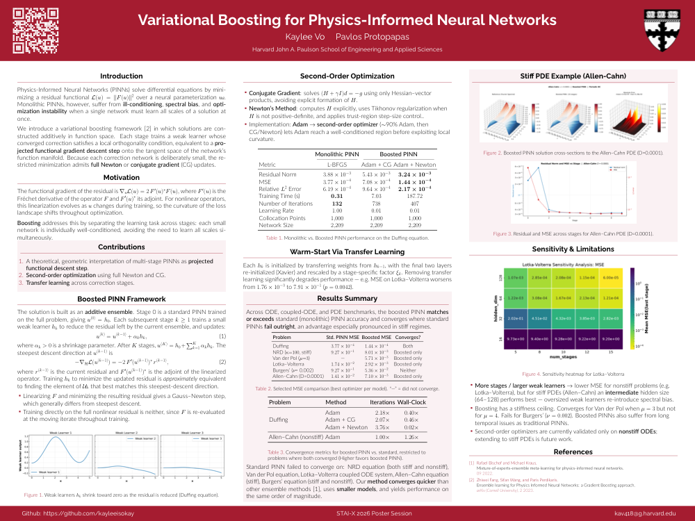
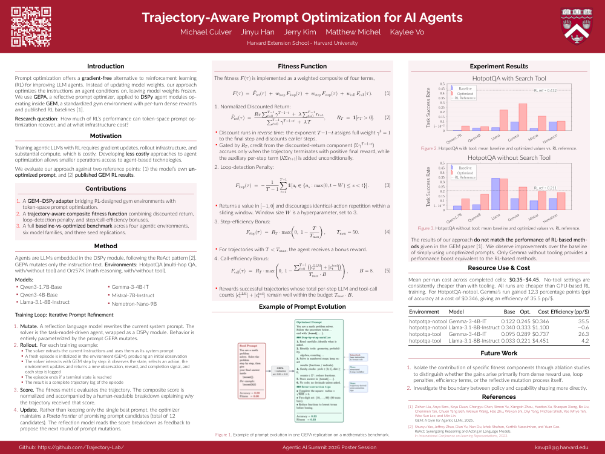

# Presentations

# Index

| Thumbnail | Title | Venue & Date | Links |
|---|---|---|---|
|  | Variational Boosting for Physics-Informed Neural Networks | Harvard University — STAI-X Jul 31 – Aug 1, 2026 | [Poster (PDF)](2026-07-stai-x/STAI_X_2026_Poster.pdf) · [Source](2026-07-stai-x/source/STAI_X_2026_Poster) |
|  | Trajectory-Aware Prompt Optimization for AI Agents | UC Berkeley — RDI Agentic AI Summit Aug 1 – 2, 2026 | [Poster (PDF)](2026-08-rdi-agentic-ai-summit/RDI_Agentic_Summit_Poster.pdf) · [Source](2026-08-rdi-agentic-ai-summit/source/RDI_Agentic_Summit_Poster) |
| _coming soon_ | SCML poster (title TBD) | University of Bath, UK — SCML Sep 14 – 17, 2026 | — |
